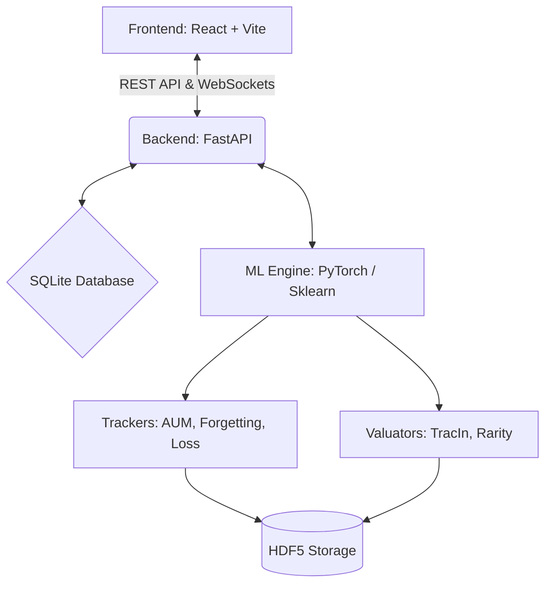

<div align="center">
  <h1>DataValuator</h1>
  <p><strong>An End-to-End Machine Learning Platform for Data Valuation and Quality Analysis</strong></p>
</div>

## Overview

**Not all data is created equal.** In modern Machine Learning, the quality of your dataset often matters more than the complexity of your model. 

**DataValuator** is a full-stack ML platform designed to identify which training samples actually contribute to your model's performance, and which ones hurt it. By tracking data behavior during and after training, DataValuator helps you discover mislabeled samples, redundant data points, and high-value anomalies.

---

## Key Features

- **Multi-Modal AI Engine**: Train on both Image datasets (PyTorch CNNs/ResNets) and Tabular datasets (Scikit-Learn Logistic Regression, Decision Trees, Random Forests, or custom Tabular Neural Nets).
- **Interactive Tabular Preprocessing UI**: Visually configure end-to-end pipelines to handle missing values, categorical encoding, scaling, outlier removal, and feature selection before kicking off training.
- **Real-Time Dashboards**: Monitor model training metrics (loss, accuracy), sample-level metrics (Forgetting Events, AUM), and system metrics via low-latency WebSockets.
- **Advanced Valuation Techniques**: State-of-the-art algorithms are built-in, including TracIn, Area Under the Margin (AUM), Forgetting Events, Leave-One-Out, and k-NN Rarity Analysis.
- **Experiments Engine**: Prove the value of your data. Prune datasets based on valuation scores or inject label noise to experimentally validate how data modifications affect real-world accuracy.

---

## Tech Stack

| Component | Technology |
|-----------|------------|
| **Frontend** | React 19, Vite, Tailwind CSS, Plotly.js, Recharts |
| **Backend** | FastAPI, Python 3.10+, WebSockets, SQLite |
| **ML Engine** | PyTorch, Scikit-Learn, FAISS (for k-NN Rarity), UMAP, HDF5 |

---

## Quick Start

### Windows (Auto-Setup)
We provide convenient batch scripts for Windows to automatically manage the environment:

1. **Start the App**: Double-click `start.bat`
   - *This automatically checks prerequisites, creates virtual environments, installs Python & Node.js dependencies, launches the backend/frontend in minimized windows, and opens the dashboard.* 
2. **Stop the App**: Double-click `stop.bat`
   - *Cleanly shuts down all related frontend and backend servers.* 

### Manual Setup (macOS / Linux / Custom)

**1. Backend**
```bash
cd backend
python3 -m venv venv
source venv/bin/activate
pip install -r requirements.txt
python run.py
```
*The API server starts at `http://localhost:8000`. Interactive API docs available at `http://localhost:8000/docs`.*

**2. Frontend**
```bash
cd frontend
npm install
npm run dev
```
*The dashboard opens at `http://localhost:5173`.*

---

## How to Use DataValuator

1. **Upload or Download Data**: Navigate to **Datasets** and either upload your custom CSV/ZIP files or download our built-in datasets (e.g., CIFAR-10).
2. **Configure Pipeline**: Go to **Training**, select your dataset, choose a model architecture, and configure your preprocessing steps (imputation, scaling, etc.).
3. **Train & Track**: Click **Start Training**. Watch the live progress via WebSocket streams.
4. **Explore Valuations**: Once complete, head to the **Explorer**. Here you can view a UMAP projection of your dataset and analyze the calculated valuation scores for every single sample.
5. **Run Experiments**: Go to **Experiments** to prune the dataset based on low valuation scores and retrain the model to see if accuracy improves or remains stable with less data.

---

## Valuation Techniques Deep-Dive

DataValuator implements several cutting-edge algorithms to score data:

| Technique | Description | Ideal Use Case |
|-----------|-------------|----------------|
| **Forgetting Events** | Tracks how often a sample transitions from being classified correctly to incorrectly during training. | Identifying noisy labels or exceptionally hard examples. |
| **AUM (Area Under Margin)** | Measures the difference between the assigned class logit and the largest other class logit across epochs. | Finding mislabeled data (negative AUM indicates the model consistently believes it belongs to another class). |
| **TracIn** | Approximates the influence of a training sample on the model's loss by tracking gradient dot products across checkpoints. | Discovering highly influential samples and "prototypes" of specific classes. |
| **Rarity Analysis (FAISS)**| Calculates the k-NN distance of a sample's embedding to its nearest neighbors in latent space. | Finding out-of-distribution (OOD) samples or rare edge-cases. |
| **Unified Score** | A weighted ensemble of the above metrics normalized into a single 0-100 score. | General purpose data pruning and quality assessment. |

---

## Architecture Diagram



---

## Contributing

Contributions are welcome! If you'd like to improve the preprocessing UI, add new ML models, or implement novel valuation algorithms, please open an issue or submit a pull request.

---

*Authored and generated by Shaurya Singh.*
